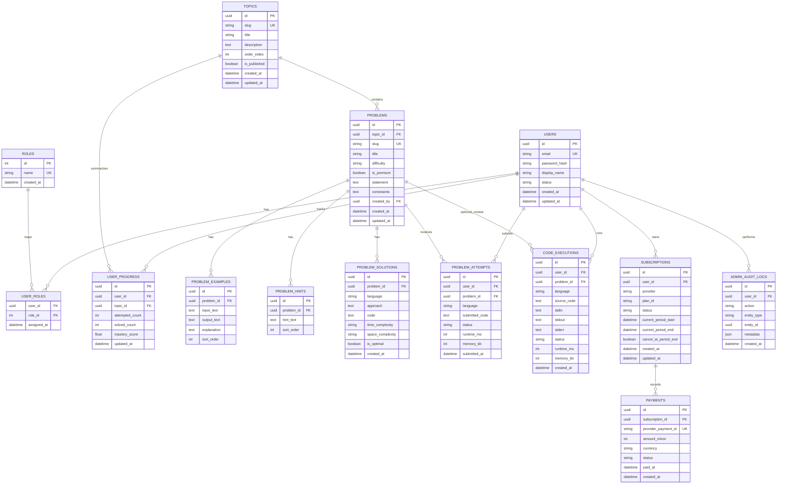

# Database ERD Draft

## Status Note (Updated: 2026-04-20)

- Current implementation includes `user_problem_progress` and migration `002_user_problem_progress.sql` for per-problem completion state.
- Subscription and payments entities are now used by checkout + webhook sync paths.
- Final mandatory last task before release signoff: run the premium entitlement regression audit across free-vs-premium problem cards/details, API enforcement, and upgrade CTA paths.

## Scope

This draft schema covers authentication, role management, topic/problem content, attempts/results, subscriptions, payments, and code execution tracking.

## ERD (Mermaid)

## Indexing Recommendations

1. `users(email)` unique index.
2. `topics(slug)` and `problems(slug)` unique index.
3. `problems(topic_id, difficulty, is_premium)` composite index.
4. `problem_attempts(user_id, submitted_at desc)` index.
5. `user_progress(user_id, topic_id)` unique composite index.
6. `subscriptions(user_id, status)` index.
7. `code_executions(user_id, created_at desc)` index.

## Migration Order

1. Core identity tables: users, roles, user_roles.
2. Content tables: topics, problems, examples, hints, solutions.
3. Learning data tables: attempts, progress, executions.
4. Commerce tables: subscriptions, payments.
5. Audit tables and operational indexes.

## Notes

1. Keep `problem_attempts.submitted_code` retention policy configurable.
2. Encrypt sensitive fields at rest where required.
3. Add row-level access checks in APIs (user can access only own progress/attempts unless admin).
